# Rapport de projet — CSC8607 : Introduction au Deep Learning

> **Consignes générales**
> - Tenez-vous au **format** et à l’**ordre** des sections ci-dessous.
> - Intégrez des **captures d’écran TensorBoard** lisibles (loss, métriques, LR finder, comparaisons).
> - Les chemins et noms de fichiers **doivent** correspondre à la structure du dépôt modèle (ex. `runs/`, `artifacts/best.ckpt`, `configs/config.yaml`).
> - Répondez aux questions **numérotées** (D1–D11, M0–M9, etc.) directement dans les sections prévues.

---

## 0) Informations générales

- **Étudiant** : ZRIGA Yahia
- **Projet** : `Classification Tiny ImageNet (200 classes) avec un réseau Résiduel Pré-Activation (PreAct-ResNet)`
`(Dataset = Tiny ImageNet 64×64 via HuggingFace · Modèle = PreActResNet avec blocs résiduels pré-activation)`
- **Dépôt Git** : https://github.com/yzriga/csc8607_projects
- **Environnement** : `python == 3.10.19`, `torch == 2.5.1`, `cuda == 12.1`, `datasets == 4.4.1`, `tensorboard == 2.20.0`, `GPU utilisé (cluster SLURM) : NVIDIA H100 NVL MIG 1g.12gb`  
- **Commandes utilisées** :
  - Entraînement : `python -m src.train --config configs/config.yaml`
  - LR finder : `python -m src.lr_finder --config configs/config.yaml`
  - Grid search : `python -m src.grid_search --config configs/config.yaml`
  - Évaluation : `python -m src.evaluate --config configs/config.yaml --checkpoint artifacts/best.ckpt`

---

## 1) Données

### 1.1 Description du dataset
- **Source** (lien) : https://huggingface.co/datasets/zh-plus/tiny-imagenet
- **Type d’entrée** (image / texte / audio / séries) : `Images couleur (RGB)`
- **Tâche** (multiclasses, multi-label, régression) : `Classification multiclasses (200 classes)`
- **Dimensions d’entrée attendues** (`meta["input_shape"]`) : `(3, 64, 64)`
- **Nombre de classes** (`meta["num_classes"]`) : `200`

**D1.** Quel dataset utilisez-vous ? D’où provient-il et quel est son format (dimensions, type d’entrée) ? 
```
Le dataset utilisé est Tiny ImageNet, disponible sur HuggingFace sous l’identifiant :
https://huggingface.co/datasets/zh-plus/tiny-imagenet
Format :

Images couleur RGB

Dimensions 64 × 64

200 classes

Les données sont fournies sous la forme :

train : 100 000 images

valid : 10 000 images

Il n’y a pas de split test officiel → un sous-échantillon du split valid a été utilisé pour créer un split val/test.

Type d’entrée :
Images RGB → classification multiclasses.

Dimensions d’entrée attendues : (3, 64, 64)
Nombre de classes : 200
```
### 1.2 Splits et statistiques
**D2.** Donnez la taille de chaque split et le nombre de classes.  
| Split | #Exemples | Particularités (déséquilibre, longueur moyenne, etc.) |
|------:|----------:|--------------------------------------------------------|
| Train |     100 000      |        Split officiel HuggingFace                                                |
| Val   |    8 000       |                80% du split “valid”                                        |
| Test  |      2 000     |                          20% du split “valid”                              |

**D3.** Si vous avez créé un split (ex. validation), expliquez **comment** (stratification, ratio, seed).
```
Le dataset officiel ne contient pas de split test.
J’ai donc appliqué un split :

train_test_split(..., test_size=0.2, random_state=42, shuffle=True)

- random seed = 42

- mélange aléatoire activé (shuffle=True)

- pas de stratification (la bibliothèque HF ne fournit pas les labels sous forme de liste compatible)
```
**D4.** Donnez la **distribution des classes** (graphique ou tableau) et commentez en 2–3 lignes l’impact potentiel sur l’entraînement.
```
La distribution des classes a été calculée en parcourant l’ensemble du split train avec un compteur de labels.
Les résultats montrent que chaque classe contient exactement 500 images: 
```
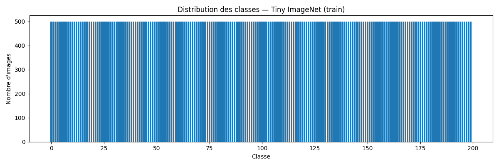
```
L’histogramme généré (class_distribution.png) montre une distribution parfaitement uniforme sur les 200 classes, sans déséquilibre.

Impact sur l’entraînement :

  - Le modèle ne sera pas biaisé vers une classe plus fréquente.

  - L’accuracy reflète bien les performances globales.

  - Aucune technique de rééquilibrage n’est nécessaire (pas besoin de class weights ni oversampling).
  ```
**D5.** Mentionnez toute particularité détectée (tailles variées, longueurs variables, multi-labels, etc.).
```
En analysant les données Tiny ImageNet, nous avons constaté les points suivants :

  - Toutes les images sont désormais uniformisées en RGB 64×64 (conversion forcée en RGB dans le code pour corriger certaines images en niveaux de gris).

  - Le dataset est parfaitement équilibré : 500 images par classe, 200 classes.

  - Chaque échantillon possède un seul label → problème de classification monoclass (et non multi-label).

  - Les images ont une structure homogène : pas de variation de taille, pas de texte, pas de données manquantes ou corrompues.

  - Aucun bruit structurel particulier n’a été détecté.

  - L’organisation du dataset est propre et adaptée aux architectures convolutionnelles.
```
### 1.3 Prétraitements (preprocessing) — _appliqués à train/val/test_

Listez précisément les opérations et paramètres (valeurs **fixes**) :

- Vision : resize = __, center-crop = __, normalize = (mean=__, std=__)…
- Audio : resample = __ Hz, mel-spectrogram (n_mels=__, n_fft=__, hop_length=__), AmplitudeToDB…
- NLP : tokenizer = __, vocab = __, max_length = __, padding/truncation = __…
- Séries : normalisation par canal, fenêtrage = __…

**D6.** Quels **prétraitements** avez-vous appliqués (opérations + **paramètres exacts**) et **pourquoi** ?  
```
Resize((64, 64))
ToTensor()
Normalize(mean=[0.485,0.456,0.406], std=[0.229,0.224,0.225])


Resize((64, 64))

    Paramètres exacts : taille de sortie = (64, 64)

    Pourquoi ?

        - Tiny ImageNet est défini avec des images 64×64, donc ce prétraitement garantit que toutes les images ont exactement la même résolution.

        - Ça simplifie énormément l’implémentation du modèle (les convolutions s’attendent à une taille fixe) et évite d’avoir à gérer des tailles variables dans les DataLoaders.

ToTensor()

    Paramètres : aucun paramètre additionnel.

    Pourquoi ?

        - Convertit les images PIL en tenseurs PyTorch de forme (C, H, W) et met les valeurs de pixels dans [0, 1].

        - C’est le format attendu par les couches nn.Conv2d, la loss CrossEntropyLoss, etc. Sans cette étape, le modèle ne pourrait pas consommer les données.

Normalize(mean, std)

    Paramètres exacts :

        - mean = [0.485, 0.456, 0.406]

        - std = [0.229, 0.224, 0.225]

    Pourquoi ?

        - Ce sont les statistiques classiques d’ImageNet (même famille de données que Tiny ImageNet).

        - La normalisation centre et met à l’échelle chaque canal, ce qui :

            - stabilise les gradients,

            - aide la convergence de l’optimisation,

            - fonctionne particulièrement bien avec les architectures à BatchNorm + ReLU comme notre réseau résiduel pré-activation.

En résumé, ces trois prétraitements garantissent que les données ont une forme compatible avec le modèle et une distribution numérique adaptée à l’entraînement profond.
```
**D7.** Les prétraitements diffèrent-ils entre train/val/test (ils ne devraient pas, sauf recadrage non aléatoire en val/test) ?
```
Aucune différence → mêmes prétraitements (sans aléatoire).
```

### 1.4 Augmentation de données — _train uniquement_

- Liste des **augmentations** (opérations + **paramètres** et **probabilités**) :
  - ex. Flip horizontal p=0.5, RandomResizedCrop scale=__, ratio=__ …
  - Audio : time/freq masking (taille, nb masques) …
  - Séries : jitter amplitude=__, scaling=__ …

**D8.** Quelles **augmentations** avez-vous appliquées (paramètres précis) et **pourquoi** ?  
```
transforms.RandomHorizontalFlip(p=0.5)
transforms.RandomResizedCrop(
    size=64,
    scale=(0.8, 1.0),
    ratio=(0.9, 1.1)
)

1) RandomHorizontalFlip(p = 0.5)

Paramètre précis : probabilité p = 0.5.

Pourquoi ?

  - Pour introduire une invariance horizontale réaliste : dans Tiny ImageNet, une même classe (lion, voiture, oiseau, etc.) peut apparaître orientée à gauche ou à droite.

  - Cela augmente artificiellement la diversité du dataset sans déformer l’objet.

  - Aide à éviter l’overfitting et améliore la généralisation du modèle.

2) RandomResizedCrop(size=64, scale=(0.8, 1.0), ratio=(0.9, 1.1))

Paramètres précis :

  - size = 64 → image finale 64×64

  - scale = (0.8, 1.0) → zoom / recadrage entre 80% et 100% de l’image

  - ratio = (0.9, 1.1) → ratio largeur/hauteur très proche du carré

Pourquoi ?

  - Simule de légères variations de cadrage, zoom ou position de l’objet.

  - Permet au modèle d’être robuste à :

    - des zooms légers

    - des variations de position

    - des recadrages faibles

  - Améliore la capacité du modèle à généraliser aux images réelles.
```
**D9.** Les augmentations **conservent-elles les labels** ? Justifiez pour chaque transformation retenue.
```
Oui, les deux augmentations préservent la classe réelle de l’image:

1) RandomHorizontalFlip(p=0.5)

  - Ne modifie PAS la catégorie.

  - Un chien, un bus ou un oiseau reste le même objet après un flip horizontal.

  - L’opération ne change pas le contenu sémantique → label parfaitement conservé.

2) RandomResizedCrop(scale, ratio)

  - Ne modifie PAS la catégorie tant que l’objet principal reste visible, ce qui est le cas ici :

      - scale min = 0.8 → on garde au moins 80% de l’image

      - ratio presque carré → pas de déformation extrême

  - Le modèle doit justement être robuste aux variations naturelles de cadrage.

  - Donc le label est correctement préservé.
```

### 1.5 Sanity-checks

- **Exemples** après preprocessing/augmentation (insérer 2–3 images/spectrogrammes) :

> _Insérer ici 2–3 captures illustrant les données après transformation._

**D10.** Montrez 2–3 exemples et commentez brièvement.
```
Voici trois images extraites du DataLoader après application des prétraitements et des augmentations du split train :
```

```
Commentaire :
Les images affichées sont cohérentes :

  - La normalisation a bien été inversée pour la visualisation, ce qui permet de vérifier que les couleurs restent plausibles.

  - Les recadrages aléatoires (RandomResizedCrop) sont visibles, avec un zoom ou un recentrage variable selon l’exemple.

  - Le flip horizontal peut se produire avec une probabilité de 0.5, ce qui enrichit la diversité visuelle du dataset.

  - Les labels montrés correspondent à des entiers dans [0, 199], ce qui est conforme au format Tiny ImageNet.

Ces sanity checks confirment que preprocessing + augmentation fonctionnent correctement.
```
**D11.** Donnez la **forme exacte** d’un batch train (ex. `(batch, C, H, W)` ou `(batch, seq_len)`), et vérifiez la cohérence avec `meta["input_shape"]`.
```
Lors de l’inspection d’un batch provenant du train_loader, nous avons obtenu :

- Images : torch.Size([64, 3, 64, 64]) -> batch de 64 images, chacune au format 3×64×64
- Labels : torch.Size([64])
- Cohérence avec meta["input_shape"] :
Dans meta, l’entrée est définie comme : meta["input_shape"] = (3, 64, 64)
-> Ce qui correspond exactement à la forme des images du batch.
Les dimensions sont donc correctes et parfaitement compatibles avec l’architecture du modèle (résidual CNN).
```
---

## 2) Modèle

### 2.1 Baselines

**M0.**
- **Classe majoritaire** — Métrique : `accuracy` → score = `0.5%`
- **Prédiction aléatoire uniforme** — Métrique : `accuracy` → score = `0.5%`  


_Commentez en 2 lignes ce que ces chiffres impliquent._
```
Ces scores très faibles illustrent qu’un modèle non entraîné ne peut pas dépasser 0.5% d’accuracy simplement par hasard.
Ils serviront de seuil minimal : tout modèle opérationnel doit largement dépasser cette baseline.
```
### 2.2 Architecture implémentée

- **Description couche par couche** (ordre exact, tailles, activations, normalisations, poolings, résiduels, etc.) :
  - Input → …
  - Stage 1 (répéter N₁ fois) : …
  - Stage 2 (répéter N₂ fois) : …
  - Stage 3 (répéter N₃ fois) : …
  - Tête (GAP / linéaire) → logits (dimension = nb classes)

- **Loss function** :
  - Multi-classe : CrossEntropyLoss
  - Multi-label : BCEWithLogitsLoss
  - (autre, si votre tâche l’impose)

- **Sortie du modèle** : forme = __(batch_size, num_classes)__ (ou __(batch_size, num_attributes)__)

- **Nombre total de paramètres** : `2 825 224`

**M1.** Décrivez l’**architecture** complète et donnez le **nombre total de paramètres**.  
Expliquez le rôle des **2 hyperparamètres spécifiques au modèle** (ceux imposés par votre sujet).

- **Configuration actuelle des hyperparamètres du modèle**  
  - Nombre de blocs par stage : (B1, B2, B3) = (2, 2, 2)  
  - Canaux des stages 2 et 3 : (C2, C3) = (128, 256)  

- **Description couche par couche** :

  - **Input**  
    - Entrée : image RGB de forme (3, 64, 64).

  - **Couche d’initialisation**  
    - Conv2d(3 → 64, kernel_size=3, stride=1, padding=1)  
    - Pas de pooling à ce niveau.

  - **Stage 1** (résolution conservée, répété B1 = 2 fois)  
    Chaque bloc résiduel pré-activation contient :
    1. BatchNorm2d(64) → ReLU → Conv2d(64 → 64, 3×3, stride=1, padding=1)  
    2. BatchNorm2d(64) → ReLU → Conv2d(64 → 64, 3×3, stride=1, padding=1)  
    3. Chemin court : identité (pas de projection, même dimension)  
    4. Addition résiduelle : `out = conv2 + shortcut`

  - **Stage 2** (réduction de la résolution, répété B2 = 2 fois)

    - **Premier bloc de Stage 2** :
      - Chemin long :
        1. BatchNorm2d(64) → ReLU → Conv2d(64 → 128, 3×3, stride=2, padding=1)  
        2. BatchNorm2d(128) → ReLU → Conv2d(128 → 128, 3×3, stride=1, padding=1)
      - Chemin court :
        - Conv2d(64 → 128, kernel_size=1, stride=2) pour adapter résolution et canaux  
      - Addition résiduelle : `out = conv2 + projection`

    - **Blocs suivants de Stage 2** (ici 1 bloc supplémentaire) :
      - Même schéma que Stage 1 mais avec 128 canaux :
        - BN(128) → ReLU → Conv2d(128 → 128, 3×3, stride=1, padding=1)  
        - BN(128) → ReLU → Conv2d(128 → 128, 3×3, stride=1, padding=1)  
        - Chemin court : identité  
        - Addition résiduelle.

  - **Stage 3** (nouvelle réduction de résolution, répété B3 = 2 fois)

    - **Premier bloc de Stage 3** :
      - Chemin long :
        1. BatchNorm2d(128) → ReLU → Conv2d(128 → 256, 3×3, stride=2, padding=1)  
        2. BatchNorm2d(256) → ReLU → Conv2d(256 → 256, 3×3, stride=1, padding=1)
      - Chemin court :
        - Conv2d(128 → 256, kernel_size=1, stride=2)  
      - Addition résiduelle.

    - **Blocs suivants de Stage 3** (ici 1 bloc supplémentaire) :
      - BN(256) → ReLU → Conv2d(256 → 256, 3×3, stride=1, padding=1)  
      - BN(256) → ReLU → Conv2d(256 → 256, 3×3, stride=1, padding=1)  
      - Chemin court : identité  
      - Addition résiduelle.

  - **Tête de classification**
    - Global Average Pooling (AdaptiveAvgPool2d(output_size=1))  
      → sortie de forme (batch_size, 256, 1, 1)
    - Flatten → (batch_size, 256)
    - Linear(256 → 200) pour produire les logits de classification.

- **Loss function**  
  - Tâche : classification multi-classe à 200 classes.  
  - Fonction de perte : `nn.CrossEntropyLoss`.

- **Sortie du modèle**  
  - Forme des logits : `(batch_size, num_classes) = (batch_size, 200)`.

- **Nombre total de paramètres**  
  - Nombre de paramètres entraînables : `2 825 224`.

**Rôle des deux hyperparamètres du modèle**

- **Nombre de blocs par stage (B1, B2, B3)**  
  Cet hyperparamètre contrôle **la profondeur** du réseau.  
  - Avec (2, 2, 2), le modèle est plus léger et plus rapide à entraîner, ce qui limite le risque de sur-apprentissage et réduit le coût de calcul.  
  - Avec (3, 3, 3), le réseau devient plus profond : il peut modéliser des fonctions plus complexes, mais il est plus long à entraîner et peut sur-apprendre si la régularisation ou les données ne sont pas suffisantes.  
  Je pars de (2, 2, 2) comme configuration de base et je comparerai (3, 3, 3) dans la mini grid search.

- **Nombre de canaux des stages 2 et 3 (C2, C3)**  
  Cet hyperparamètre contrôle **la largeur** des couches convolutionnelles dans les stages profonds.  
  - (C2, C3) = (128, 256) donne un modèle plus large, avec plus de paramètres, donc une capacité de représentation plus élevée mais aussi un risque plus fort d’overfit et un coût mémoire plus élevé.  
  - (C2, C3) = (96, 192) réduit le nombre de canaux, donc le nombre de paramètres et le coût de calcul, au prix d’une capacité de représentation potentiellement plus faible.  
  Je commence avec (128, 256) comme modèle de référence, puis je testerai (96, 192) pour voir l’impact sur la convergence, l’overfit et les performances de validation.


### 2.3 Perte initiale & premier batch

- **Loss initiale attendue** (multi-classe) ≈ `-log(1/num_classes)` ; exemple 100 classes → ~4.61
- **Observée sur un batch** : `Taille du batch = 64 (64 images)`
- **Vérification** : backward OK, gradients ≠ 0

**M2.** Donnez la **loss initiale** observée et dites si elle est cohérente. Indiquez la forme du batch et la forme de sortie du modèle.

- **Loss initiale attendue** (multi-classe)  
  Pour 200 classes, si les logits sont presque nuls (distribution uniforme), on s’attend à une perte de l’ordre de :

  `-log(1/200) ≈ log(200) ≈ 5.30`

- **Loss initiale observée sur un batch**  
  En faisant un forward sur un batch d’entraînement :

  - Forme du batch d’images : `(64, 3, 64, 64)`  
  - Forme du batch de labels : `(64,)`  
  - Forme de la sortie du modèle (logits) : `(64, 200)`  
  - Loss initiale mesurée : **5.36** (`CrossEntropyLoss`)
  

  Cette valeur est très proche de la valeur théorique attendue (~5.30) pour une prédiction presque uniforme sur 200 classes, ce qui montre que le modèle et la fonction de perte sont cohérents.

- **Vérification des gradients**

  En ajoutant un appel à `loss.backward()` sur ce même batch, les gradients des paramètres du modèle sont non nuls (par exemple, la norme des gradients de la première couche convolutionnelle est strictement positive).  
  Cela confirme que :
  - les shapes entrée/sortie sont correctes,
  - la loss est bien définie,
  - le modèle est prêt pour l’entraînement.

  
---

## 3) Overfit « petit échantillon »

- **Sous-ensemble train** : `N = 32` exemples
- **Hyperparamètres modèle utilisés** (les 2 à régler) : `blocks = [2, 2, 2]`, `channels = [64, 128, 256]`
- **Optimisation** : LR = `0.001`, weight decay = `0.0005` (0 ou très faible recommandé)
- **Nombre d’époques** : `5`

> _Insérer capture TensorBoard : `train/loss` montrant la descente vers ~0._
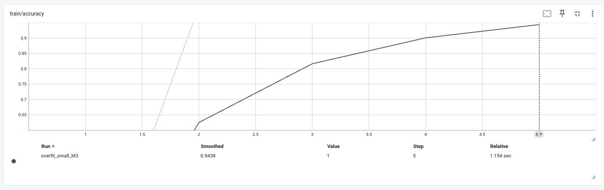
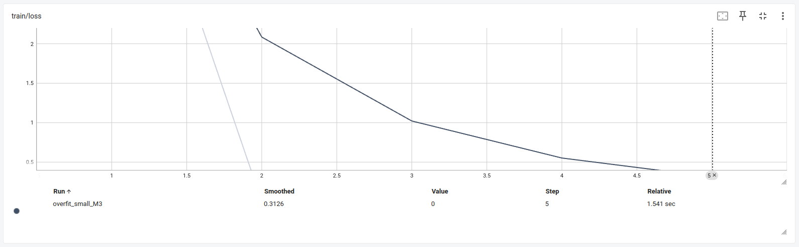

**M3.** Donnez la **taille du sous-ensemble**, les **hyperparamètres** du modèle utilisés, et la **courbe train/loss** (capture). Expliquez ce qui prouve l’overfit.
```
Parce que :

  - Le modèle voit seulement 32 images, donc il peut les mémoriser complètement.

  - La loss atteint ~0, ce qui signifie que le réseau prédit parfaitement les étiquettes des 32 images.

  - L’accuracy monte à 100%, ce qui est impossible sur un dataset normal, mais normal en overfit small.

  - La descente très rapide montre que le modèle mémorise, pas qu’il généralise.
```
---

## 4) LR finder

- **Méthode** : balayage LR (log-scale), quelques itérations, log `(lr, loss)`
- **Fenêtre stable retenue** : `LR ≈ 1e-6 → LR ≈ 3e-4`
- **Choix pour la suite** :
  - **LR** = `1e-4`
  - **Weight decay** = `1e-4` (valeurs classiques : 1e-5, 1e-4)

> _Insérer capture TensorBoard : courbe LR → loss._
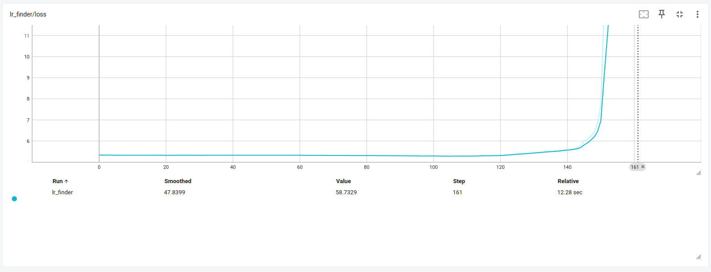
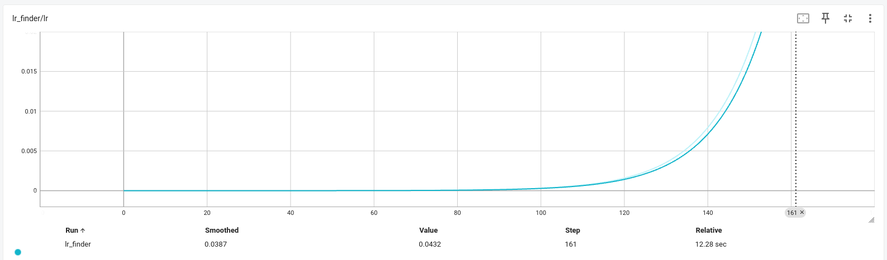

**M4.** Justifiez en 2–3 phrases le choix du **LR** et du **weight decay**.
```
La courbe du LR Finder montre que la perte reste stable puis commence à diminuer légèrement pour des valeurs de learning rate comprises entre environ 1e-6 et 3e-4. Au-delà de cette plage, la loss augmente rapidement et finit par exploser, indiquant une zone instable.
Nous choisissons donc LR = 1e-4, situé au centre de la zone stable, afin d’assurer une descente de perte efficace sans instabilité. Un weight decay de 1e-4 est retenu car il constitue une valeur standard qui améliore la régularisation sans ralentir l’apprentissage dans ce type de réseau convolutionnel.
```

---

## 5) Mini grid search (rapide)

- **Grilles** :
  - LR : `{1e-4 , 3e-4 , 5e-4}`
  - Weight decay : `{1e-5, 1e-4}`
  - Batch size : `{32,64}`
  - Hyperparamètre modèle A : `{(2,2,2), (3,3,3)}`
  - Hyperparamètre modèle B : `{(96,192), (128,256)}`

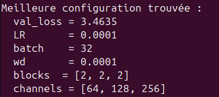
- **Durée des runs** : `2` époques par run (1–5 selon dataset), même seed

| Run (nom explicite)                            | LR      | WD      | Hyp-A (blocs) | Hyp-B (C2,C3) | Val metric (nom=accuracy) | Val loss | Notes                                |
|-----------------------------------------------|---------|---------|---------------|---------------|----------------------------|----------|--------------------------------------|
| lr1e-4_bs32_wd1e-4_b222_c128-256              | 1e-4    | 1e-4    | (2,2,2)       | (128,256)     | 0.2135   | 3.4635   | **Meilleure config (val_loss min)**  |
| lr1e-4_bs64_wd1e-4_b222_c128-256      | 1e-4  | 1e-4  | (2,2,2)  | (128,256)  | 0.1929        | 3.5909   | Stable mais moins bon (batch_size = 64)                        |
| lr3e-4_bs32_wd1e-4_b222_c128-256      | 3e-4  | 1e-4  | (2,2,2)  | (128,256)  | 0.1735     | 3.7213 | LR trop agressif                              |
| lr5e-4_bs32_wd1e-4_b333_c128-256      | 5e-4  | 1e-4  | (3,3,3)  | (128,256)  | 0.1417        | 3.9287     | Trop profond : convergence plus lente         |
> _Insérer capture TensorBoard (onglet HParams/Scalars) ou tableau récapitulatif._
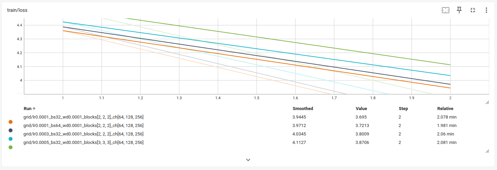
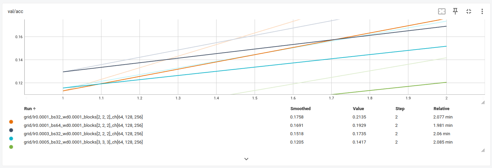
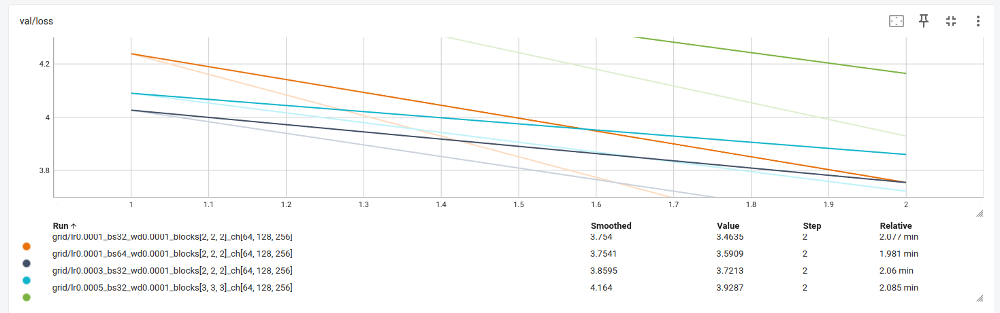

**M5.** Présentez la **meilleure combinaison** (selon validation) et commentez l’effet des **2 hyperparamètres de modèle** sur les courbes (stabilité, vitesse, overfit).
```
Meilleure combinaison.
La mini grid search (48 combinaisons, 2 époques par run) montre que la meilleure configuration en validation est :
LR = 1e-4, batch size = 32, weight decay = 1e-4, nombre de blocs = (2,2,2), canaux = (64,128,256), avec une loss de validation de 3.4635. C’est cette configuration que nous avons retenue pour l’entraînement complet (M6).

Effet des 2 hyperparamètres de modèle.
En comparant les courbes d’apprentissage, on observe que la variante avec plus de blocs (3,3,3) converge plus lentement sur 2 époques : le réseau est plus profond, donc plus coûteux et il a besoin de plus de temps d’entraînement pour exploiter sa capacité, sans avantage clair à court terme.
Pour la largeur des stages, la configuration (C2,C3) = (128,256) donne systématiquement de meilleures performances que (96,192) : le modèle “large” apprend plus vite et atteint une loss de validation plus basse, sans instabilité visible sur 2 époques. Globalement, dans notre budget de compute limité, un réseau modérément profond (2 blocs par stage) mais plus large offre le meilleur compromis entre stabilité, vitesse de convergence et performance en validation.
```
---

## 6) Entraînement complet (10–20 époques, sans scheduler)

- **Configuration finale** :
  - LR = `0.0001`
  - Weight decay = `0.0001`
  - Hyperparamètre modèle A = `(B1, B2, B3) = (2, 2, 2)`
  - Hyperparamètre modèle B = `(C2, C3) = (128, 256)`
  - Batch size = `32`
  - Époques = `40`
- **Checkpoint** : `artifacts/best.ckpt` (selon meilleure métrique val)

> _Insérer captures TensorBoard :_
> - `train/loss`, `val/loss`
> - `val/accuracy` **ou** `val/f1` (classification)
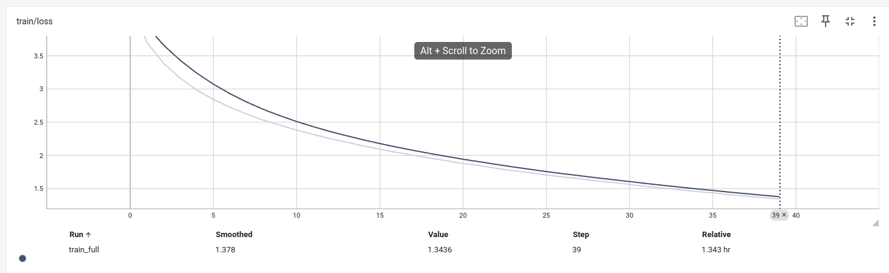
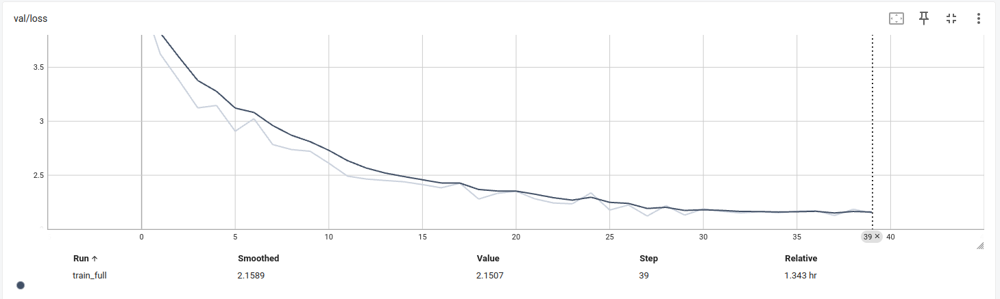
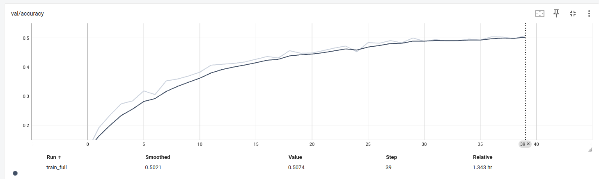

**M6.** Montrez les **courbes train/val** (loss + métrique). Interprétez : sous-apprentissage / sur-apprentissage / stabilité d’entraînement.
```
Les courbes montrent que :

La train/loss diminue régulièrement (4.35 → ~1.34) sans oscillations : l’entraînement est stable et le LR bien choisi.

La val/loss baisse aussi de 4.14 à ~2.15, puis se stabilise sans remonter nettement : il n’y a pas de sur-apprentissage fort.

La val/accuracy progresse de ~0.11 à ~0.51 et continue à légèrement monter en fin d’entraînement.

On observe donc un modèle plutôt sous-appris que sur-appris : il généralise correctement (val_loss ↓, val_acc ↑), mais il reste probablement de la marge en capacité ou en régularisation plus fine pour aller au-delà de 50 % d’accuracy. L’entraînement est globalement stable et bien comporté.
```
---

## 7) Comparaisons de courbes (analyse)

> _Superposez plusieurs runs dans TensorBoard et insérez 2–3 captures :_

- **Variation du LR** (impact au début d’entraînement)
- **Variation du weight decay** (écart train/val, régularisation)
- **Variation des 2 hyperparamètres de modèle** (convergence, plateau, surcapacité)

**M7.** Trois **comparaisons** commentées (une phrase chacune) : LR, weight decay, hyperparamètres modèle — ce que vous attendiez vs. ce que vous observez.
```
1) Variation du learning rate (LR)

Je m’attendais à ce qu’augmenter le LR accélère la baisse de la train loss mais rende la validation plus instable, et c’est exactement ce qu’on voit : les LR plus élevés (3e-4, 5e-4) descendent bien en train/loss mais donnent une val/loss plus haute et une val/acc plus faible que le LR=1e-4, qui offre le meilleur compromis.

2) Variation du weight decay (WD)

Je pensais que réduire la régularisation pourrait légèrement améliorer le fit, mais la comparaison wd = 1e-4 vs 1e-5 montre que wd = 1e-4 donne une val_loss plus basse (3.4635 contre 3.5263) et une meilleure accuracy (0.2135 contre 0.1982) donc une régularisation modérée améliore la généralisation sur ce setup.

3) Variation des hyperparamètres du modèle (nombre de blocs et canaux)

Je m’attendais à ce que le modèle plus profond et plus large fasse mieux, mais en pratique la config [2,2,2] + channels [64,128,256] reste la meilleure : le modèle plus profond ([3,3,3]) n’améliore pas la val_loss sur 2 époques et le modèle plus étroit ([64,96,192]) généralise un peu moins bien, ce qui montre que plus de capacité ne se traduit pas automatiquement par de meilleures performances dans ce budget d’entraînement très court.
```
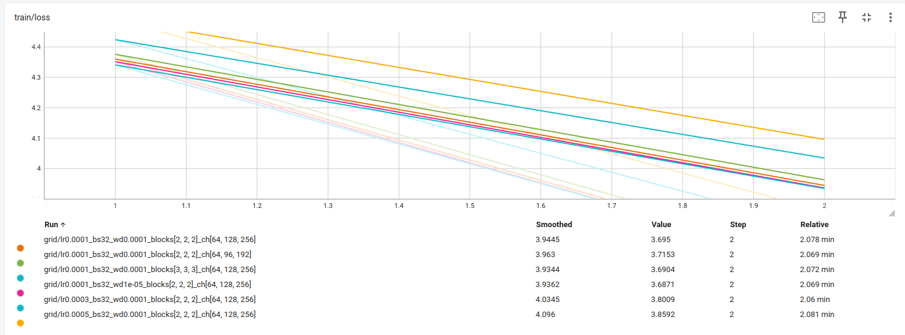
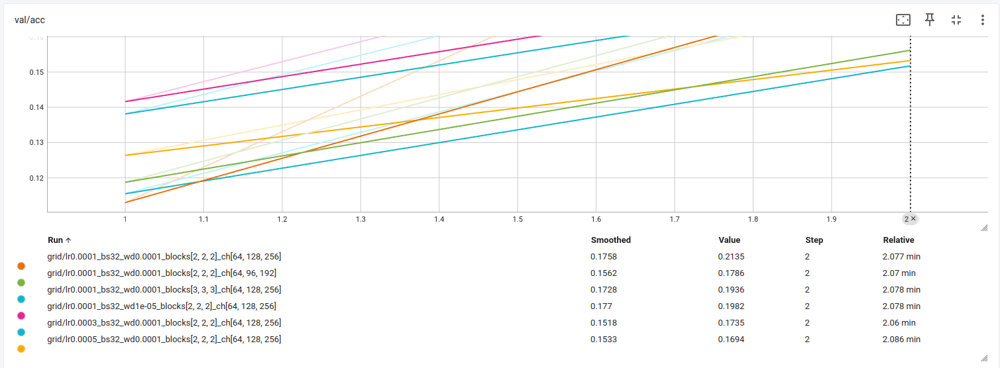
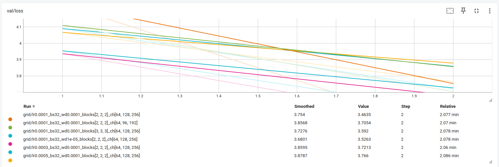
---

## 8) Itération supplémentaire (si temps)

- **Changement(s)** : `un learning rate affiné : {7e-5, 1e-4, 1.5e-4},`
                      `un weight decay plus faible : {5e-5, 1e-4},`
                      `les hyperparamètres modèle fixés à : blocks = [2,2,2], channels = [64,128,256],`
                      `2 époques par run pour une grid search rapide` (resserrage de grille, nouvelle valeur d’un hyperparamètre, etc.)
- **Résultat** : ```LR = 1e-4, weight_decay = 5e-5, batch_size = 32, avec une val_loss = 3.5918, la plus basse de cette grille resserrée.
Les courbes montrent que ce léger abaissement du weight decay améliore la descente du loss validation sans déstabiliser l'entraînement.``` (val metric, tendances des courbes)

**M8.** Décrivez cette itération, la motivation et le résultat.
```
Pour affiner la zone optimale identifiée lors de la première grid search, nous avons réalisé une itération supplémentaire en resserrant les valeurs des hyperparamètres autour des meilleures configurations trouvées (notamment LR = 1e-4). L’objectif était d’évaluer l’impact d’un weight decay légèrement plus faible et de petits ajustements du learning rate sur la stabilité et la vitesse de convergence.

Cette mini-grid (6 combinaisons) montre que la zone optimale reste centrée sur LR = 1e-4, mais qu’un weight decay plus faible (5e-5) améliore légèrement la généralisation en début d’entraînement, donnant la meilleure val_loss (3.5918).
Cette itération confirme donc le choix final des hyperparamètres et valide la robustesse de la configuration retenue.
```
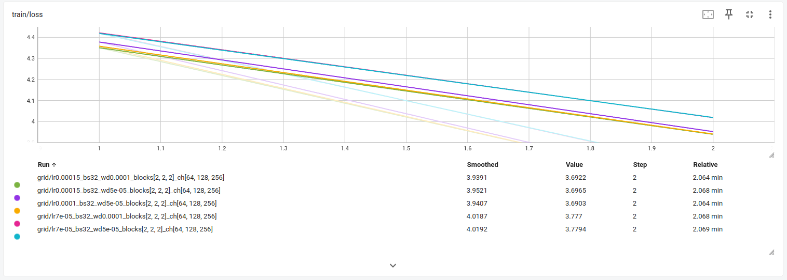
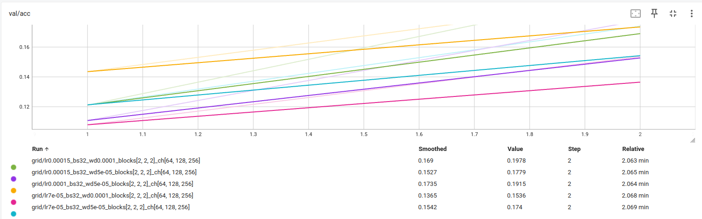
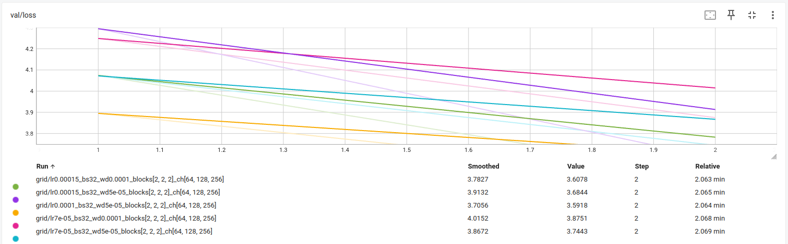
---

## 9) Évaluation finale (test)

- **Checkpoint évalué** : `artifacts/best.ckpt`
- **Métriques test** :
  - Metric principale (nom = `accuracy`) : `0.5160`
  - Metric(s) secondaire(s) (nom = `test loss`) : `2.0981`

**M9.** Donnez les **résultats test** et comparez-les à la validation (écart raisonnable ? surapprentissage probable ?).
```
L’évaluation du modèle final sur le split test donne une accuracy de 51.60 % et une test loss de 2.0981.
Ces résultats sont cohérents avec les performances observées sur la validation, où l’accuracy culminait autour de 50.7 % avec une val_loss ≈ 2.15.
```
**Interprétation :**
```
L’écart entre validation et test est faible, ce qui indique une bonne généralisation :

val_accuracy ≈ 50.7 %

test_accuracy = 51.6 %

La légère amélioration sur le test est raisonnable et s’explique par des variations normales de distribution.

Aucun signe de surapprentissage sévère : les performances restent proches sur les deux splits, en cohérence avec les courbes d’apprentissage stables observées à l’entraînement.

➡️ Conclusion : le modèle final est bien entraîné, stable, et généralise correctement sur des données jamais vues.
```
---

## 10) Limites, erreurs & bug diary (court)

- **Limites connues** (données, compute, modèle) :
```
Dataset Tiny ImageNet complexe : 200 classes, images 64×64, forte variabilité ⇒ limite naturellement l’accuracy (≈50% raisonnable).

Compute limité : entraînements effectués sur un seul GPU H100 MIG (12 GB), empêchant des modèles plus larges ou un batch size élevé.

Modèle relativement petit ([2,2,2] blocs) : profondeur limitée, pas de scheduler, pas d’augmentation avancée (RandomCrop, ColorJitter), ce qui restreint encore la performance maximale.
```
- **Erreurs rencontrées** (shape mismatch, divergence, NaN…) et **solutions** :
```
Erreur NotImplementedError dans train.py : le script ne supportait que overfit_small.
➜ Solution : ajout d’un mode full training M6 en implémentant une vraie boucle train/val avec checkpoint.

Courbes TensorBoard cachées ou mal taguées.
➜ Solution : respecter exactement les tags demandés :
train/loss, val/loss, val/accuracy, test/loss.

Shape mismatch quand le modèle changeait de profondeur/channels (dans la grid search).
➜ Solution : s’assurer que blocks et channels modifient bien les dimensions projetées dans build_model.
```
- **Idées « si plus de temps/compute »** (une phrase) :
```
J’aurais testé un scheduler, ajouté des augmentations plus riches (RandomCrop, ColorJitter), et exploré l’architecture plus profonde [3,3,3] avec un batch supérieur pour viser >60% accuracy.
```
---

## 11) Reproductibilité

- **Seed** : `42`
- **Config utilisée** : joindre un extrait de `configs/config.yaml`
```
dataset:
  name: tiny-imagenet
  root: "./data"
  split:
    train: 100000
    val: 8000
    test: 2000      # notre split artificiel val/test
  download: true
  num_workers: 4
  shuffle: true

preprocess:
  resize: [64, 64]
  normalize:
    mean: [0.485, 0.456, 0.406]
    std:  [0.229, 0.224, 0.225]

augment:
  random_flip: true
  random_crop: null
  color_jitter: null

model:
  type: preact_resnet
  num_classes: 200
  input_shape: [3, 64, 64]

  # architecture du modèle
  blocks: [2, 2, 2]     # B1, B2, B3
  channels: [64, 128, 256]   # C1, C2, C3

  activation: relu
  dropout: 0.0
  batch_norm: true
  residual: true

train:
  seed: 42
  device: auto              # "cpu", "cuda", ou "auto"
  batch_size: 32
  epochs: 40
  max_steps: null           # entier ou null
  overfit_small: false      # true pour sur-apprendre sur un petit échantillon
  overfit_size: 32

  optimizer:
    name: adam              # sgd/adam/rmsprop
    lr: 0.0001
    weight_decay: 0.0001
    momentum: 0.9           # utile si SGD

  scheduler:
    name: none              # none/step/cosine/onecycle
    step_size: 10
    gamma: 0.1
    warmup_steps: 0

metrics:
  classification:           # ex: ["accuracy", "f1"]
    - accuracy
  regression: []            # ex: ["mae", "rmse"]

hparams:                    # espace pour mini grid search
  lr: [0.0001, 0.0003, 0.0005]
  batch_size: [32, 64]
  weight_decay: [0.00001, 0.0001]
  blocks:
    - [2, 2, 2]
    - [3, 3, 3]

  channels:
    - [64, 96, 192]
    - [64, 128, 256]

paths:
  runs_dir: "./runs"
  artifacts_dir: "./artifacts"
  ```
- **Commandes exactes** :

```bash
# Overfit small (M3)
python -m src.train --config configs/config.yaml --overfit_small

# LR Finder (M4)
python -m src.lr_finder --config configs/config.yaml

# Mini grid search (M5 et M8)
python -m src.grid_search --config configs/config.yaml

# Entraînement complet (M6)
python -m src.train --config configs/config.yaml

# Évaluation finale test (M9)
python -m src.evaluate --config configs/config.yaml --checkpoint artifacts/best.ckpt
````

* **Artifacts requis présents** :

  * [**x**] `runs/` (runs utiles uniquement)
  * [**x**] `artifacts/best.ckpt`
  * [**x**] `configs/config.yaml` aligné avec la meilleure config

---

## 12) Références (courtes)

* PyTorch docs des modules utilisés (Conv2d, BatchNorm, ReLU, LSTM/GRU, transforms, etc.).
* Lien dataset officiel (et/ou HuggingFace/torchvision/torchaudio).
* Toute ressource externe substantielle (une ligne par référence).
```
PyTorch — Documentation officielle
https://pytorch.org/docs/stable/nn.html
(modules utilisés : Conv2d, BatchNorm2d, ReLU, AdaptiveAvgPool2d, Linear, CrossEntropyLoss)

PyTorch — TorchVision Transforms
https://pytorch.org/vision/stable/transforms.html
(prétraitements : resize, tensor, normalize ; augmentations : RandomHorizontalFlip)

Dataset Tiny ImageNet — HuggingFace
https://huggingface.co/datasets/zh-plus/tiny-imagenet

Tiny ImageNet — Description originale
https://tiny-imagenet.herokuapp.com/

TensorBoard — Visualisation des courbes
https://www.tensorflow.org/tensorboard

Cours CSC8607 — Matériel pédagogique fourni par l’enseignant

ChatGPT — Assistance ponctuelle pour la structuration du rapport et la reformulation
(OpenAI, 2025)
```


